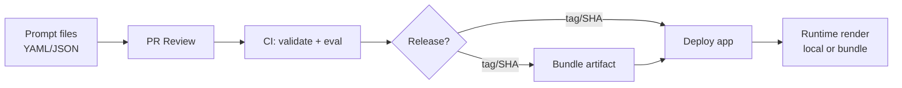

# InstructVault (`ivault`)
**Git‑first prompt hub for teams and individual developers.**

InstructVault makes prompts **first‑class, governed, testable, versioned artifacts** — just like code — while keeping runtime **fast and local**.

## What this does (at a glance)
- **Prompts live in Git** as YAML/JSON files
- **CI validates + evaluates** prompts on every change
- **Releases are tags/SHAs**, reproducible by design
- **Runtime stays lightweight** (local read or bundle artifact)

## System flow (Mermaid)


## Why this exists
Enterprises already have Git + PR reviews + CI/CD. Prompts usually don’t.
InstructVault brings **prompt‑as‑code** without requiring a server, database, or platform.

## Vision
Short version: Git‑first prompts with CI governance and zero‑latency runtime.  
Full vision: `docs/vision.md`

## Features
- ✅ Git‑native versioning (tags/SHAs = releases)
- ✅ CLI‑first (`init`, `validate`, `render`, `eval`, `diff`, `resolve`, `bundle`)
- ✅ LLM‑framework agnostic (returns standard `{role, content}` messages)
- ✅ CI‑friendly reports (JSON + optional JUnit XML)
- ✅ No runtime latency tax (local read or bundle)
- ✅ Optional playground (separate package)

## Install
### Users
```bash
pip install instructvault
```

### Contributors
```bash
git clone <your-repo>
cd instructvault
python -m venv .venv
source .venv/bin/activate
pip install -e ".[dev]"
pytest
```

## Quickstart (end‑to‑end)

### 1) Initialize a repo
```bash
ivault init
```

### 2) Create a prompt
`prompts/support_reply.prompt.yml` (YAML or JSON)
```yaml
spec_version: "1.0"
name: support_reply
description: Respond to a support ticket with empathy and clear steps.
model_defaults:
  temperature: 0.2

variables:
  required: [ticket_text]
  optional: [customer_name]

messages:
  - role: system
    content: |
      You are a support engineer. Be concise, empathetic, and action-oriented.
  - role: user
    content: |
      Customer: {{ customer_name | default("there") }}
      Ticket:
      {{ ticket_text }}

tests:
  - name: must_contain_customer_and_ticket
    vars:
      ticket_text: "My order arrived damaged."
      customer_name: "Alex"
    assert:
      contains_all: ["Customer:", "Ticket:"]
```

### 3) Validate + render locally
```bash
ivault validate prompts
ivault render prompts/support_reply.prompt.yml --vars '{"ticket_text":"My app crashed.","customer_name":"Sam"}'
```

### 4) Add dataset‑driven eval
`datasets/support_cases.jsonl`
```jsonl
{"vars":{"ticket_text":"Order arrived damaged","customer_name":"Alex"},"assert":{"contains_any":["Ticket:"]}}
{"vars":{"ticket_text":"Need refund"},"assert":{"contains_all":["Ticket:"]}}
```

```bash
ivault eval prompts/support_reply.prompt.yml --dataset datasets/support_cases.jsonl --report out/report.json --junit out/junit.xml
```

Note: Prompts must include at least one inline test. Datasets are optional.
Migration tip: if you need to render a prompt that doesn’t yet include tests, use
`ivault render --allow-no-tests` or add a minimal test first.

### 5) Version prompts with tags
```bash
git add prompts datasets
git commit -m "Add support prompts + eval dataset"
git tag prompts/v1.0.0
```

### 6) Load by Git ref at runtime
```python
from instructvault import InstructVault

vault = InstructVault(repo_root=".")
msgs = vault.render(
  "prompts/support_reply.prompt.yml",
  vars={"ticket_text":"My order is delayed", "customer_name":"Ava"},
  ref="prompts/v1.0.0",
)
```

### 7) Bundle prompts at build time (optional)
```bash
ivault bundle --prompts prompts --out out/ivault.bundle.json --ref prompts/v1.0.0
```

```python
from instructvault import InstructVault
vault = InstructVault(bundle_path="out/ivault.bundle.json")
```

## How teams use this in production
1) Prompt changes go through PRs
2) CI runs `validate` + `eval`
3) Tags or bundles become the deployable artifact
4) Apps load by tag or bundle (no runtime network calls)

## Datasets (why JSONL)
Datasets are **deterministic eval inputs** checked into Git. This makes CI reproducible and audit‑friendly.
For cloud datasets, use a CI pre‑step (e.g., download from S3) and then run `ivault eval` on the local file.

## Playground (optional)
A minimal playground exists under `playground/` for local or org‑hosted use.
It lists prompts, renders with variables, and runs evals — without touching production prompts directly.
For local dev, run from the repo root:
```bash
export IVAULT_REPO_ROOT=/path/to/your/repo
PYTHONPATH=. uvicorn ivault_playground.app:app --reload
```


Optional auth:
```bash
export IVAULT_PLAYGROUND_API_KEY=your-secret
```
Then send `x-ivault-api-key` in requests (or keep it behind your org gateway).
If you don’t set the env var, no auth is required.

## Docs
- `docs/vision.md`
- `docs/governance.md`
- `docs/ci.md`
- `docs/playground.md`
- `docs/cookbooks.md`
- `docs/dropin_guide.md`
- `docs/release_checklist.md`
- `docs/ci_templates/gitlab-ci.yml`
- `docs/ci_templates/Jenkinsfile`
- `CHANGELOG.md`
- `CODE_OF_CONDUCT.md`

## License
Apache‑2.0
