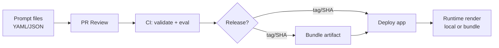
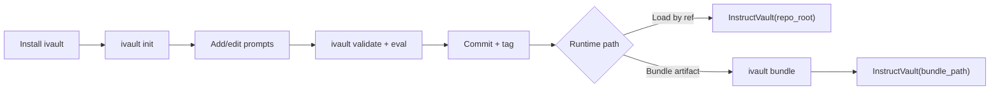
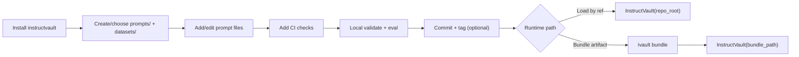
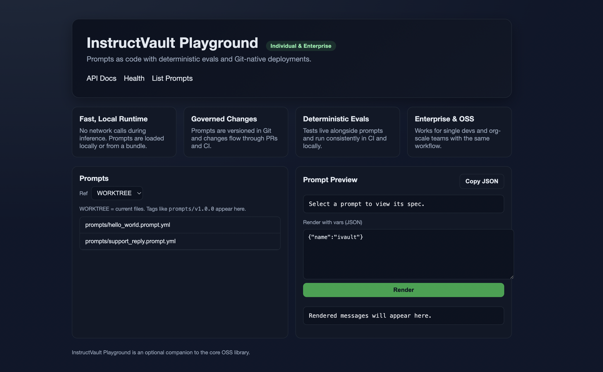

<div align="center">
  
</div>

# InstructVault (`ivault`)
**Git‑first prompt hub for teams and individual developers.**

- Prompts are governed artifacts: versioned in Git, validated in CI, and loaded locally at runtime.
- Teams ship prompt changes as safely as code without added latency or vendor lock‑in.
- A small, auditable core with deterministic evals, release tags, and optional policy hooks.

InstructVault is a Git‑first “prompt‑as‑code” system. Prompts live in your repo,
are validated and evaluated in CI, released via tags/SHAs, and loaded locally at runtime
directly from Git or via a bundle artifact.

## What this does (at a glance)
- **Prompts live in Git** as YAML/JSON files
- **CI validates + evaluates** prompts on every change
- **Releases are tags/SHAs**, reproducible by design
- **Runtime stays lightweight** (local read or bundle artifact)

## System flow (Mermaid)


## Why this exists
Enterprises already have Git + PR reviews + CI/CD. Prompts usually don’t.
InstructVault brings **prompt‑as‑code** without requiring a server, database, or platform.

## Vision
Short version: Git‑first prompts with CI governance and zero‑latency runtime.  
Full vision: `docs/vision.md`

## Features
- ✅ Git‑native versioning (tags/SHAs = releases)
- ✅ CLI‑first (`init`, `validate`, `render`, `eval`, `diff`, `resolve`, `bundle`)
- ✅ LLM‑framework agnostic (returns standard `{role, content}` messages)
- ✅ CI‑friendly reports (JSON + optional JUnit XML)
- ✅ No runtime latency tax (local read or bundle)
- ✅ Optional playground (separate package)

## Install
### Users
```bash
pip install instructvault
```

### Contributors
```bash
git clone <your-repo>
cd instructvault
python -m venv .venv
source .venv/bin/activate
pip install -e ".[dev]"
pytest
```

## Quickstart (end‑to‑end)

### End‑user workflow (typical)
1) Install `instructvault` in your app repo (or a dedicated prompts repo)
2) Run `ivault init` once to scaffold `prompts/`, `datasets/`, and CI
3) Add or edit prompt files under `prompts/`
4) Validate and eval locally (`ivault validate`, `ivault eval`)
5) Commit prompt changes and create a tag (e.g., `prompts/v1.0.0`)
6) In your app, render by git ref (tag/branch/SHA) or ship a bundle artifact

### Using InstructVault in an existing app repo
1) `pip install instructvault`
2) Create a `prompts/` folder (or pick an existing one)
3) Add prompt files under `prompts/` and at least one inline test per prompt
4) Add CI checks (copy from `docs/ci.md` or run `ivault init` to scaffold workflow)
5) Validate/eval locally: `ivault validate prompts`, `ivault eval prompts/<file>.prompt.yml --report out/report.json`
6) Commit prompts and optionally tag: `git tag prompts/v1.0.0`
7) At runtime, load by ref or bundle artifact

### Visual workflow (new app repo)


### Visual workflow (existing app repo)


### 1) Initialize a repo
```bash
ivault init
```

### 2) Create a prompt
`prompts/support_reply.prompt.yml` (YAML or JSON)
```yaml
spec_version: "1.0"
name: support_reply
description: Respond to a support ticket with empathy and clear steps.
model_defaults:
  temperature: 0.2

variables:
  required: [ticket_text]
  optional: [customer_name]

messages:
  - role: system
    content: |
      You are a support engineer. Be concise, empathetic, and action-oriented.
  - role: user
    content: |
      Customer: {{ customer_name | default("there") }}
      Ticket:
      {{ ticket_text }}

tests:
  - name: must_contain_customer_and_ticket
    vars:
      ticket_text: "My order arrived damaged."
      customer_name: "Alex"
    assert:
      contains_all: ["Customer:", "Ticket:"]
```

### 3) Validate + render locally
```bash
ivault validate prompts
ivault render prompts/support_reply.prompt.yml --vars '{"ticket_text":"My app crashed.","customer_name":"Sam"}'
```

#### Safety tip: 
- Add `--safe` to scan rendered output for common secret patterns.
- Use `--strict-vars` to forbid unknown vars and `--redact` to mask detected secrets.
- Use `--policy /path/to/policy.py` to enforce custom compliance rules.

### 4) Add dataset‑driven eval
`datasets/support_cases.jsonl`
```jsonl
{"vars":{"ticket_text":"Order arrived damaged","customer_name":"Alex"},"assert":{"contains_any":["Ticket:"]}}
{"vars":{"ticket_text":"Need refund"},"assert":{"contains_all":["Ticket:"]}}
```

```bash
ivault eval prompts/support_reply.prompt.yml --dataset datasets/support_cases.jsonl --report out/report.json --junit out/junit.xml
```

#### Note: Prompts must include at least one inline test. Datasets are optional.
#### Migration tip: if you need to render a prompt that doesn’t yet include tests, use  `ivault render --allow-no-tests` or add a minimal test first.

#### Spec migration check:
```bash
ivault migrate prompts
```

### 5) Version prompts with tags
```bash
git add prompts datasets
git commit -m "Add support prompts + eval dataset"
git tag prompts/v1.0.0
```

### 6) Load by Git ref at runtime
```python
from instructvault import InstructVault

vault = InstructVault(repo_root=".")
msgs = vault.render(
  "prompts/support_reply.prompt.yml",
  vars={"ticket_text":"My order is delayed", "customer_name":"Ava"},
  ref="prompts/v1.0.0",
)
```

Troubleshooting: if you pass a `ref` and see `FileNotFoundError` from `store.read_text`,
the prompt file must exist at that ref and be committed in the same repo. Tags/branches
must point to commits that include the prompt file.

### Multi‑repo usage (app repo + prompts repo)
If your prompts live in a separate repo, point `repo_root` to that repo (not your app repo),
or bundle prompts at build time and ship the bundle with your app.
```python
from instructvault import InstructVault

vault = InstructVault(repo_root="/path/to/prompts-repo")
msgs = vault.render(
  "prompts/support_reply.prompt.yml",
  vars={"ticket_text":"My order is delayed"},
  ref="prompts/v1.0.0",
)
```

### Troubleshooting (common)
- `FileNotFoundError ... read_text` with `ref`: prompt not committed at that ref, or wrong repo_root
- `No prompt files found`: path passed to `ivault validate` doesn’t contain `*.prompt.yml|json`
- `prompt must include at least one test`: add a minimal inline test or use `--allow-no-tests` for render

### 7) Bundle prompts at build time (optional)
```bash
ivault bundle --prompts prompts --out out/ivault.bundle.json --ref prompts/v1.0.0
```

```python
from instructvault import InstructVault
vault = InstructVault(bundle_path="out/ivault.bundle.json")
```

## Notebooks
- `examples/notebooks/instructvault_colab.ipynb`
  [](https://colab.research.google.com/github/05satyam/instruct_vault/blob/main/examples/notebooks/instructvault_colab.ipynb)
- `examples/notebooks/instructvault_rag_colab.ipynb`
  [](https://colab.research.google.com/github/05satyam/instruct_vault/blob/main/examples/notebooks/instructvault_rag_colab.ipynb)
- `examples/notebooks/instructvault_openai_colab.ipynb`
  [](https://colab.research.google.com/github/05satyam/instruct_vault/blob/main/examples/notebooks/instructvault_openai_colab.ipynb)

## Examples
- `examples/ivault_demo_template/README.md`

## Example Policies
- `examples/policies/policy_example.py`
- `examples/policies/policy_pack.py`

## How teams use this in production
1) Prompt changes go through PRs
2) CI runs `validate` + `eval`
3) Tags or bundles become the deployable artifact
4) Apps load by tag or bundle (no runtime network calls)

## Datasets (why JSONL)
Datasets are **deterministic eval inputs** checked into Git. This makes CI reproducible and audit‑friendly.
For cloud datasets, use a CI pre‑step (e.g., download from S3) and then run `ivault eval` on the local file.

## Playground (optional)
A minimal playground exists under `playground/` for local or org‑hosted use.
It lists prompts, renders with variables, and runs evals — without touching production prompts directly.
For local dev, run from the repo root:
```bash
export IVAULT_REPO_ROOT=/path/to/your/repo
PYTHONPATH=. uvicorn ivault_playground.app:app --reload
```



Optional auth:
```bash
export IVAULT_PLAYGROUND_API_KEY=your-secret
```
Then send `x-ivault-api-key` in requests (or keep it behind your org gateway).
If you don’t set the env var, no auth is required.

## Docs
- `docs/dropin_guide.md` — minimal setup if you already have CI
- `docs/cookbooks.md` — workflows (tags, bundles, multi‑repo, RAG)
- `docs/spec.md` — prompt spec and validation rules
- `docs/ci.md` — CI setup and reports
- `docs/governance.md` — CODEOWNERS and release guardrails
- `docs/playground.md` — optional local/hosted playground
- `docs/audit_logging.md` — audit fields and patterns
- `docs/vision.md` — product vision and guiding principles
- `docs/release_checklist.md` — release checklist for maintainers
- `docs/ci_templates/gitlab-ci.yml` — GitLab CI example
- `docs/ci_templates/Jenkinsfile` — Jenkins example
- `CHANGELOG.md`
- `CODE_OF_CONDUCT.md`

## License
Apache‑2.0
